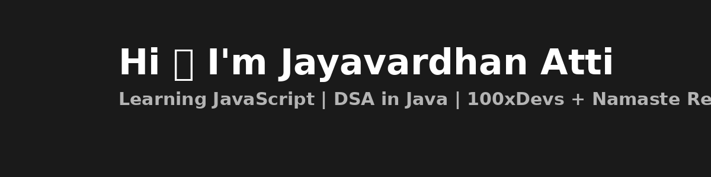

  

# 🖤 About Me

I'm **Jayavardhan Atti**, a dedicated tech learner on a mission to master **JavaScript** and become a future **Full-Stack Developer**.  
Currently part of the **100xDevs Cohort 3** and following **Namaste React** to build strong frontend skills and I’m a final year B.Tech student majoring in Computer Science.
---

## 🔍 Currently Learning

- 📘 Core **JavaScript** concepts (functions, arrays, DOM, async)
- 🧱 **HTML & CSS** basics
- ⚛️ Starting **React** with Namaste React
- 🧠 **DSA in Java** using Striver’s A2Z and Love Babbar 450

---

## 🎯 2025 Goals

- Master frontend (HTML, CSS, JavaScript, React)
- Learn backend (Node.js, Express) & MongoDB
- Build full-stack projects
- Start learning DevOps & AI after full-stack skills

---

## 🛠️ Tech Stack Roadmap

| Domain       | Tools (Current + Upcoming)               |
|--------------|-------------------------------------------|
| Languages    | Java, JavaScript                         |
| Frontend     | HTML, CSS, React.js (soon)               |
| Backend      | Node.js, Express.js (planned)            |
| Database     | MongoDB (planned)                        |
| Tools        | Git, GitHub, VS Code                     |

---

---

## 🔗 Connect With Me

  
  
  
  

---

## 📊 GitHub Stats

  
  

---

  🌌 Let's grow together in code, in health, and in life. Thanks for stopping by!

